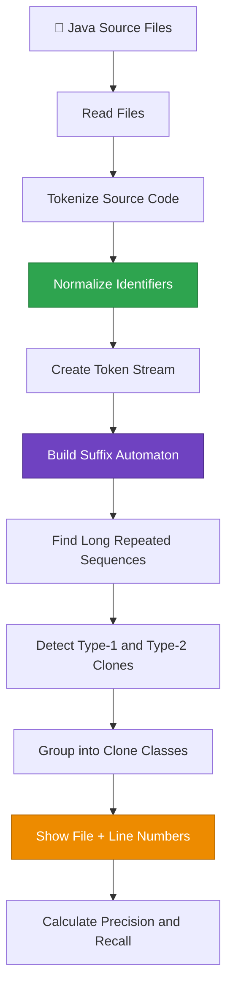

<div align="center">

# 🧬 Source Code Clone Detector

### Finding duplicate code with tokens and a **Suffix Automaton**

*Course project for **Data Structures and Algorithms - 3 (25CS2103E)** · K L Deemed to be University · A.Y. 2026-2027*

<br/>


<br/>

**Precision 90% · Recall 88% · 6 clone classes · 5 Java files · 450 lines analysed**

[Overview](#-overview) · [How It Works](#-how-it-works) · [The Algorithm](#-the-algorithm) · [Results](#-results) · [Getting Started](#-getting-started) · [Roadmap](#-roadmap) · [Team](#-team)

</div>

---

## 📖 Overview

Software projects accumulate **code clones**: fragments that are duplicated or nearly duplicated across files. Clones make code harder to maintain, and a bug fixed in one copy often survives in the others.

Spotting them by hand across many files is slow, and plain text comparison breaks the moment someone renames a variable or reformats a block.

**Source Code Clone Detector** solves this by working on *meaning-bearing tokens* instead of raw text:

1. Break Java source into tokens.
2. **Normalize** identifiers so renamed variables and methods look identical.
3. Feed the token stream into a **suffix automaton**.
4. Extract long repeated token sequences and report them as **clone classes**, with file names and line numbers.
5. Score itself against a **seeded benchmark** (precision and recall).

> 💡 The goal is a clone detector simple enough to build from scratch, yet backed by a data structure that makes it genuinely efficient. It is a practical showcase of DSA in software engineering.

---

## ✨ Features

| | Feature | Description |
|---|---|---|
| 🔤 | **Tokenizer** | Converts Java source into keywords, identifiers, operators, and symbols |
| 🧹 | **Identifier normalization** | Variable and function names collapse to a common form, so renamed copies still match |
| ⚡ | **Suffix automaton engine** | Represents every substring of the token stream compactly; finds repeats efficiently |
| 🧩 | **Type-1 and Type-2 detection** | Exact clones and renamed clones |
| 📍 | **Precise reporting** | Clone groups listed with file names and line numbers |
| 📊 | **Built-in evaluation** | Precision and recall measured on a seeded benchmark |

---

## 🧠 Clone Types

| Type | Definition | Detected? |
|:---:|---|:---:|
| **Type-1** | Identical code, apart from whitespace, layout, and comments | ✅ |
| **Type-2** | Structurally identical code where identifiers (variable / function names) differ | ✅ |
| **Type-3** | Near-miss clones: statements added, removed, or modified | 🔜 Future scope |
| **Type-4** | Different code, same functionality | 🔜 Future scope |

**Example of a Type-2 clone**: both fragments normalize to the same token sequence.

```java
// File A                              // File B
int sum = 0;                           int total = 0;
for (int i = 0; i < n; i++) {          for (int k = 0; k < m; k++) {
    sum += arr[i];                         total += data[k];
}                                      }
```

---

## ⚙️ How It Works



### Pipeline stages

| # | Stage | What happens |
|:-:|---|---|
| 1 | **Read** | Load every `.java` file in the target project |
| 2 | **Tokenize** | Split code into tokens, dropping layout and comments, so formatting stops mattering |
| 3 | **Normalize** | Replace identifier names with a common placeholder so renaming stops mattering |
| 4 | **Token stream** | Concatenate files into one stream, remembering each token's file and line |
| 5 | **Suffix automaton** | Build the automaton over the stream |
| 6 | **Repeat extraction** | Find the longest substrings that occur at least twice |
| 7 | **Classification** | Raw-identical repeats are Type-1; repeats that match only after normalization are Type-2 |
| 8 | **Report** | Group occurrences into clone classes and map them back to files and lines |
| 9 | **Evaluate** | Compare detections with a seeded benchmark to compute precision and recall |

---

## 🔬 The Algorithm

### Why a suffix automaton?

A **suffix automaton** (SAM) is the smallest deterministic automaton that accepts *every suffix* of a string, and therefore encodes *every substring*, in linear space. It is a powerful tool for repeated-substring problems.

| Property | Value |
|---|---|
| Build time | **O(n)** (amortized, online) |
| States | at most **2n − 1** |
| Transitions | at most **3n − 4** |
| Query | "does this substring exist?" in **O(m)** |

Here, `n` is the length of the token stream. Because the alphabet is *tokens* rather than characters, clones are found at the level of code structure.

### Finding repeats

Each automaton state represents a group of substrings that share the same set of end positions. The detector:

1. Builds the automaton incrementally, one token at a time.
2. Propagates **occurrence counts** from each state up its **suffix links**.
3. Keeps states whose substring occurs **2 or more times**; the state's `len` gives the longest repeated sequence it represents.
4. Filters by a **minimum clone length** so trivial repeats like `i++` don't flood the report.
5. Maps each surviving occurrence back to `(file, start line, end line)`.

### Complexity at a glance

| Approach | Cost | Handles renamed identifiers? |
|---|---|:---:|
| Naive text comparison of all fragment pairs | roughly O(n²) or worse | ❌ |
| Token-based + **suffix automaton** (this project) | **O(n)** build | ✅ |
| AST-based comparison | heavier preprocessing | ✅ |

### Where it fits in DSA-3

This project is built around the **string and suffix-structure** part of the DSA-3 syllabus (Module 2: String Algorithms), including the suffix-structure family (suffix arrays, LCP, suffix automata) and the broader idea of picking the right advanced algorithm for the right problem class.

---

## 📊 Results

Evaluated on a seeded benchmark of Java files with known, planted clones.

| Metric | Value |
|---|:---:|
| Java files tested | **5** |
| Total lines analysed | **450** |
| Total tokens | **1,280** |
| Clone classes detected | **6** |
| ↳ Type-1 clones | 2 |
| ↳ Type-2 clones | 4 |
| Longest repeated sequence | **18 tokens** |
| **Precision** | **90%** |
| **Recall** | **88%** |

```text
                 true clones found
   Precision = ─────────────────────────
               all clones reported by tool

                 true clones found
   Recall    = ─────────────────────────
               all clones actually present
```

- **High precision (90%)**: when the tool reports a clone, it is almost always a real one.
- **High recall (88%)**: it finds nearly all of the planted clones.

---

## 🚀 Getting Started

### Prerequisites

| Requirement | Version |
|---|---|
| Java Development Kit | **JDK 17 or later** |
| OS | Windows / Linux / macOS |
| IDE (optional) | IntelliJ IDEA / Eclipse / VS Code |
| Libraries | Java Standard Library only, with no external dependencies |

**Hardware**: any ordinary laptop works (Intel Core i3 or equivalent, 4 GB RAM, 500 MB free storage).

### Clone the repository

```bash
git clone https://github.com/Arun888star/DSA-3-Source-Code-Clone-Detector-Project.git
cd DSA-3-Source-Code-Clone-Detector-Project
```

### Build and run

Source files live in the [`Practical Programs/`](Practical%20Programs) directory.

```bash
cd "Practical Programs"
javac *.java
java Main <path-to-java-source-folder>
```

### Sample report format

```text
==== Clone Report ====
Clone Class #1  [Type-2]  length: 18 tokens
  ├─ Calculator.java   lines 12–19
  └─ Statistics.java   lines 40–47

Clone Class #2  [Type-1]  length: 11 tokens
  ├─ Utils.java        lines  5–9
  └─ Helper.java       lines 22–26

---- Evaluation ----
Precision: 90%   Recall: 88%
```

The report lists each clone class with its type, length in tokens, and every file and line range where it occurs, followed by the evaluation summary.

---

## 🗂️ Repository Structure

```text
DSA-3-Source-Code-Clone-Detector-Project/
├── 📂 Practical Programs/        # Java source code of the detector
├── 📄 DSA-3_Project Abstract.docx # Project report and abstract
├── 📊 DSA-3_Project_PPT.pptx      # Project presentation
└── 📘 README.md                   # You are here
```

---

## 📚 Background: Clone Detection Approaches

| Approach | Idea | Trade-off |
|---|---|---|
| **Text-based** | Compare code as plain text | Finds exact copies; breaks on renamed variables |
| **Token-based** *(used here)* | Compare token sequences | Robust to formatting and naming; simple to implement |
| **AST-based** | Compare syntax trees | Catches structural similarity; more processing |
| **String-matching structures** | Suffix structures for repeats | Efficient repeated-substring search |

**Research gap addressed:** many advanced clone detectors are complex to build. This project pairs a *simple token-based pipeline* with a *suffix automaton*, so it stays easy to understand while still giving useful, efficient clone detection.

---

## 🛣️ Roadmap

- [x] Tokenizer for Java source
- [x] Identifier normalization
- [x] Suffix automaton over the token stream
- [x] Type-1 and Type-2 clone detection
- [x] File and line-number reporting
- [x] Precision / recall evaluation on a seeded benchmark
- [ ] Support more languages (C++, JavaScript, C#)
- [ ] **Type-3** clone detection (added, removed, or modified statements)
- [ ] **Type-4** clone detection (semantically similar code)
- [ ] Web interface for uploading and analysing source code

---

## 👥 Team

| Name | Roll No. |
|---|---|
| **Thodeti Arun** | 2520030456 |

**Guide:** Mrs. Ch. Anitha, Assistant Professor, CS&IT
**Section:** 11 · **Institution:** K L Deemed to be University, Hyderabad, Telangana, India

---

## 🙏 Acknowledgements

Thanks to **Mrs. Ch. Anitha** for her guidance throughout the course, and to the DSA-3 course team.

Reference texts from the course: *Introduction to Algorithms* (CLRS), *Algorithm Design* (Kleinberg & Tardos), and Jeff Erickson's *Algorithms*.

---

<div align="center">

**If you found this useful, consider leaving a ⭐**

*Built with ☕ and a lot of tokens.*

</div>
